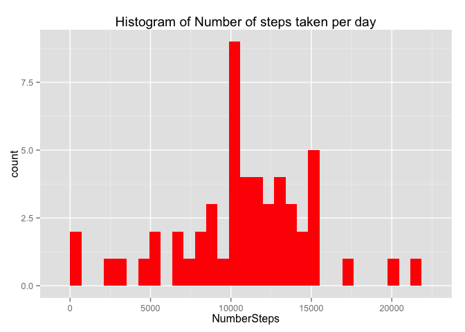
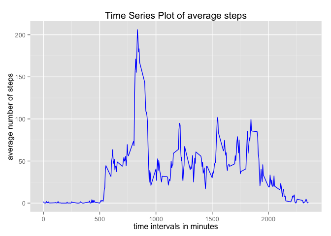
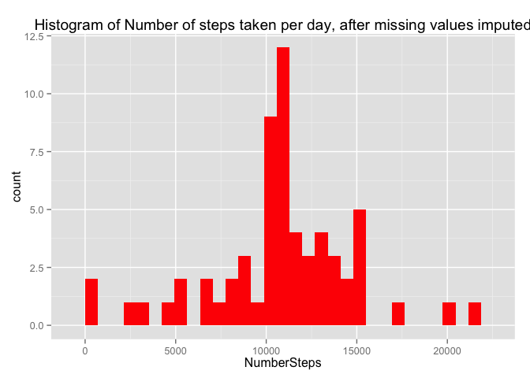
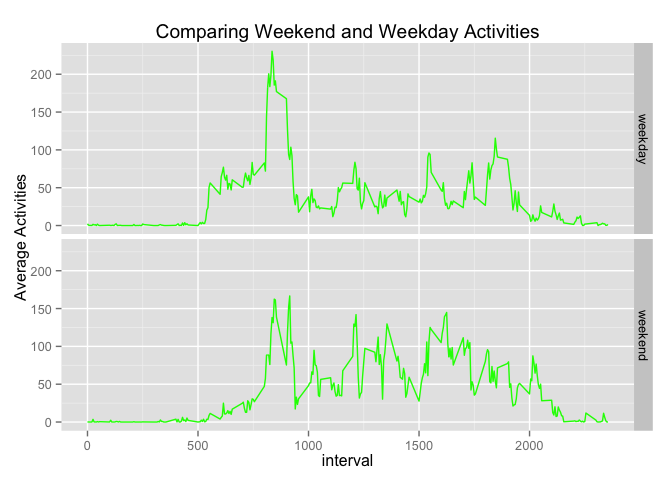

# Reproducible Research: Peer Assessment 1

##Set global options
Suppress library loading messages


## Loading and preprocessing the data

```r
dt <- read.table(unzip("activity.zip",'activity.csv'),header=TRUE,sep = ',')
num_missing <-sum(is.na(dt$steps))
percent_missing <- paste(as.character(format(num_missing/nrow(dt)*100,digits=4)),'%',sep='')
```
There are **2304** missing variables, which is **13.11%** of the overall population. 

## What is mean total number of steps taken per day?

```r
library(plyr)
library(ggplot2)
total_num <- ddply(dt,'date',summarise,NumberSteps = sum(steps,na.omit=TRUE))
missing_date <- subset(total_num, is.na(NumberSteps) == TRUE)$date
total_num <- subset(total_num,is.na(NumberSteps) == FALSE)

med <- as.character(median(total_num$NumberSteps))
avg <- as.character(mean(total_num$NumberSteps))

ggplot(total_num,aes(NumberSteps)) + geom_histogram(fill = 'red') + ggtitle('Histogram of Number of steps taken per day')
```

 

The dates **2012-10-01, 2012-10-08, 2012-11-01, 2012-11-04, 2012-11-09, 2012-11-10, 2012-11-14, 2012-11-30** don't have any steps information recorded, so they are not listed in the graph.

After the missing values are removed, the median number of steps taken per day is **10766** and the mean is **10767.1886792453**.


## What is the average daily activity pattern?

```r
avg_by_interval <- ddply(dt,'interval',summarise,avg_steps=mean(steps,na.rm=TRUE))

max_interval <- subset(avg_by_interval,avg_steps == max(avg_steps))$interval

ggplot(avg_by_interval,aes(interval,avg_steps)) + geom_line(colour = 'Blue') + xlab('time intervals in minutes') + ylab('average number of steps') + ggtitle('Time Series Plot of average steps')
```

 

The time interval with the maximum number of steps is **835-840**.


## Imputing missing values

```r
total_NA <- sum(is.na(dt$steps))
dt1 <- subset(dt,is.na(steps) == TRUE)
dt2 <- subset(dt,is.na(steps) == FALSE)

dt1 <- join(dt1,avg_by_interval, by = 'interval')
dt1$steps <- dt1$avg_steps

dt <- rbind(dt1[1:3],dt2)
total_num <- ddply(dt,'date',summarise,NumberSteps = sum(steps,na.omit=TRUE))


med <- as.character(median(total_num$NumberSteps))
avg <- as.character(mean(total_num$NumberSteps))

ggplot(total_num,aes(NumberSteps)) + geom_histogram(fill = 'red') + ggtitle('Histogram of Number of steps taken per day, after missing values imputed')
```

 

I used interval averages to impute missing values  
After the missing values are imputed, the median number of steps taken per day is **10767.1886792453** and the mean is **10767.1886792453**.   
**Median differs but Mean does not differ, and imputation increases Median**

## Are there differences in activity patterns between weekdays and weekends?

```r
dt$date <- as.POSIXlt(dt$date)
dt <- mutate(dt, wkd = ifelse(weekdays(date) == 'Saturday'|weekdays(date) == 'Sunday','weekend','weekday'))
avg_steps_wkd <- ddply(dt, .(wkd,interval),summarise,avg_steps = mean(steps))

ggplot(avg_steps_wkd,aes(interval,avg_steps)) + geom_line(colour = 'Green') + facet_grid(wkd~.) + ggtitle('Comparing Weekend and Weekday Activities') + ylab('Average Activities')
```

 

As we can see from the plot, **weekend has on average higher activity patterns than weekdays**.

